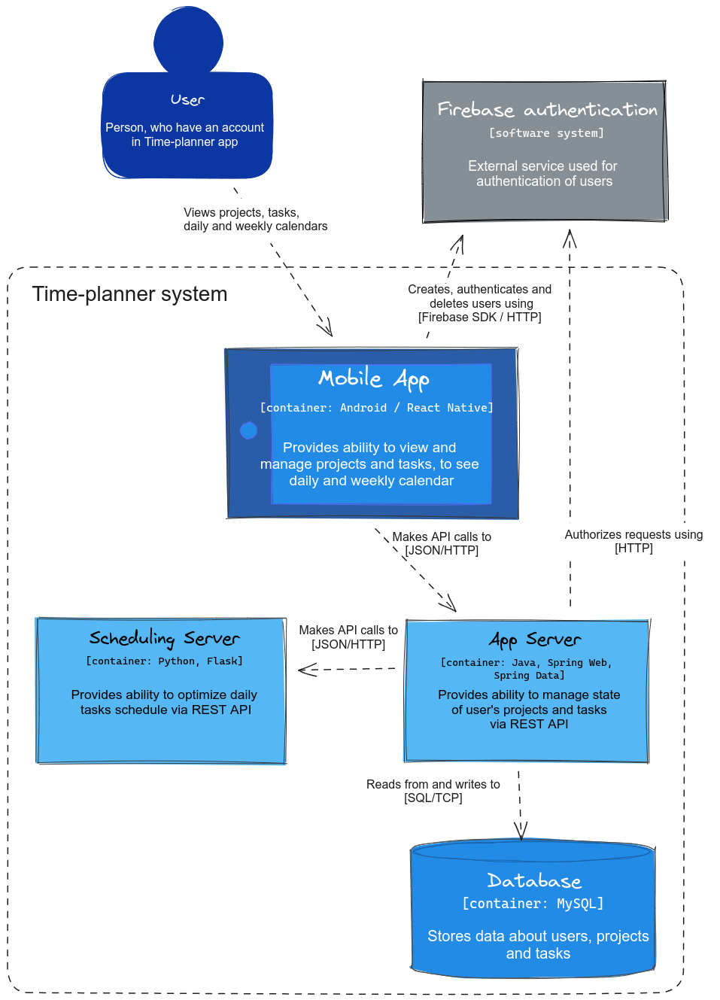

# Time-planner app

## Showcase

<table>
    <tr>
        <td>Daily planner</td>
        <td>Daily planner navigation</td>
    </tr>
    <tr>
    <td></td>
    <td></td>
    </tr>  
    <tr>
        <td>Log in</td>
        <td>Projects and tasks</td>
    </tr>
    <tr>
        <td></td>
        <td></td>
    </tr>
</table>

Comming up:

- Weekly plan
- Recurring tasks
- Nested tasks
- Manage "done" tasks
- Reporting module

## Architecture

Application server: [time-planner](https://github.com/erysman/time-planner)

Scheduling server: [time-planner-scheduling](https://github.com/erysman/time-planner-scheduling)

## Technologies

- React Native
- Expo
- Expo Router
- Tamagui
- React Query
- Reanimated

## Maintenance

### Generate new version of Api client from backend openApi definition

1. Generate latest `time-planner-server-openapi.json` in backend repo, copy it to `config` directory in this repo
2. Run `npm run generate-api`
3. Commit and push changes

### Build app

#### Development build

`eas build -p android --profile development`

#### Production preview build

`eas build -p android --profile preview`